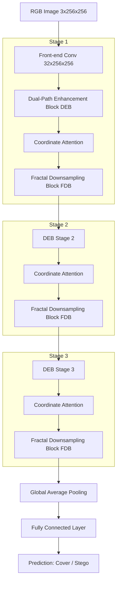

# Universal Color Dual-Path Fractal Network (UC-DFNet) for Color Image Steganalysis

This repository contains a complete, runnable research prototype for **Universal Color Dual-Path Fractal Network (UC-DFNet)**, a deep learning architecture specialized in detecting hidden steganographic messages in color images (steganalysis).

---

## 1. Abstract
Digital image steganography is widely used to embed secret information into cover images, posing potential security and privacy threats. Steganysis aims to detect the presence of these hidden payloads. However, detecting steganographic signals in color images is challenging due to the extremely weak signal-to-noise ratio (SNR) of stego perturbations compared to complex image textures. This project implements **UC-DFNet**, a deep neural network tailored to capture high-frequency noise artifacts across color channels. UC-DFNet combines a parallel Dual-Path Enhancement Block (DEB), a coordinate-based spatial attention mechanism, and a Fractal Downsampling Block (FDB) that replaces standard pooling to preserve subtle steganographic changes.

---

## 2. Problem Statement
Most modern steganographic methods (such as Least Significant Bit (LSB) matching, HUGO, or S-UNIWARD) embed messages by slightly modifying pixel values in a way that is imperceptible to the human eye. In color images, these modifications are distributed across red, green, and blue channels. Standard deep learning architectures (like ResNet or MobileNet) fail in steganalysis because:
1. They are optimized for semantic classification, which discards high-frequency details.
2. Standard pooling operations (Max/Average pooling) act as low-pass filters, smoothing out and destroying the delicate, high-frequency noise patterns created by steganographic embedding.
3. They lack mechanisms to combine features across different receptive fields to capture local noise correlations.

---

## 3. Objectives
The objectives of the UC-DFNet project are to:
- Build a **lightweight and highly sensitive** deep learning network specifically for color image steganalysis.
- Implement a **Dual-Path Enhancement Block (DEB)** that leverages both residual learning (for noise signal extraction) and dense feature reuse (for feature propagation without degradation).
- Incorporate **Coordinate Attention (CA)** to highlight suspicious local steganographic regions in color channels.
- Design a **Fractal Downsampling Block (FDB)** using multi-branch downsampling convolutions to retain high-frequency residuals while reducing spatial dimensions.
- Provide a feature-rich, interactive **Streamlit dashboard** showing real-time inference, confidence scores, intermediate feature activations, and **Grad-CAM explainability**.

---

## 4. Architecture Explanation

The UC-DFNet model contains the following key components:



### A. Dual-Path Enhancement Block (DEB)
The DEB consists of two parallel paths that receive the input:
- **Path 1 (Residual Learning Path):** Extracts residual noise patterns using convolutional layers and adds the input representation via a skip connection. This enables stable gradient flow and focuses on extracting noise residuals.
- **Path 2 (Dense Feature Reuse Path):** Employs dense connections where preceding convolutional outputs are concatenated with the input and fed into subsequent convolutions. This maximizes the reuse of raw channel features and prevents the vanishing of weak steganographic patterns.
The outputs of both paths are concatenated and fused via a $1\times1$ convolution.

### B. Coordinate Attention Module (CA)
Steganographic changes are highly localized. Standard channel attention (like Squeeze-and-Excitation) discards spatial coordinates, while spatial attention discards channel coordinates. **Coordinate Attention** factorizes 2D global pooling into horizontal and vertical 1D average pooling vectors. It encodes direction-aware and position-sensitive information, allowing the network to highlight the exact spatial regions where the stego payload is hidden.

### C. Fractal Downsampling Block (FDB)
Standard max or average pooling layers destroy high-frequency details. The FDB replaces pooling with a multi-level branching structure:
1. **Branch 1:** A single $3\times3$ convolution with stride 2.
2. **Branch 2:** A sequence of $1\times1$ stride-1 and $3\times3$ stride-2 convolutions.
3. **Branch 3:** An average pool followed by a $3\times3$ stride-1 convolution.
Features from all branches are concatenated and fused. This multi-scale downsampler preserves high-frequency edge information and texture gradients, making the network extremely sensitive to pixel-level perturbations.

---

## 5. Methodology & Training Pipeline
1. **Synthetic Dataset Generation:** 
   To provide an out-of-the-box runnable environment, `dataset/stego_dataset.py` generates synthetic, highly textured images containing lines, circles, gradients, and camera sensor noise.
   - **Class 0 (Cover):** Clean textured images.
   - **Class 1 (Stego):** Modified versions of the Cover images, embedded with a secret message in their LSB (Least Significant Bits) using LSB matching steganography.
2. **Data Augmentation:** 
   To ensure the model generalizes, the training pipeline applies:
   - Random rotations (up to 15 degrees)
   - Horizontal and vertical flips
   - Color jittering (brightness and contrast adjustments)
   - Random cropping and resizing to $256 \times 256$ pixels
3. **Optimizations:**
   - **Loss function:** Cross Entropy Loss.
   - **Optimizer:** Adam with $L_2$ regularization (weight decay = $1e-4$) to prevent overfitting.
   - **LR Scheduler:** `ReduceLROnPlateau` reducing the learning rate by 0.5 when validation loss plateaus.
   - **Early Stopping:** Stops training if validation loss does not improve for 5 consecutive epochs.
   - **Performance Metrics:** Accuracy, Precision, Recall, and F1 Score are computed at the end of each epoch.

---

## 6. Project Directory Structure

```
uc_dfnet/
│
├── data/                    # Generated training data folder (Cover / Stego images)
│   ├── cover/
│   └── stego/
│
├── dataset/                 # Dataset loader and augmentation scripts
│   ├── __init__.py
│   └── stego_dataset.py
│
├── models/                  # PyTorch model architecture definitions
│   ├── __init__.py
│   ├── attention.py         # Coordinate Attention Block
│   ├── fractal_block.py     # Fractal Downsampling Block (FDB)
│   └── ucdfnet.py           # Dual-Path Block (DEB) and overall UCDFNet
│
├── train.py                 # Training script with validation metrics & curve generation
├── test.py                  # Evaluation script with Grad-CAM and feature map extraction
├── app.py                   # Streamlit dashboard interface
├── utils.py                 # LSB embedding/extraction & plotting utilities
├── requirements.txt         # Required Python packages
└── README.md                # Detailed project documentation
```

---

## 7. How to Install and Run

### Prerequisites
Make sure you have Python 3.8+ installed. Install the dependencies using pip:
```bash
pip install -r requirements.txt
```

### Option A: Run the Streamlit Dashboard (Recommended)
Launch the interactive Streamlit app:
```bash
streamlit run app.py
```
From the app:
1. Expand the **Prototype Training Wizard** in the sidebar.
2. Click **Run Synthetic Training** to automatically generate synthetic cover/stego datasets and train the UC-DFNet model. You will see training loss, validation curves, and confusion matrices appear in the app once training completes.
3. Upload any image in the **Input Image Selection** panel or pick a synthetic sample.
4. Click **Run UC-DFNet Steganalysis** to get prediction results, confidence scores, Grad-CAM overlays, and intermediate feature map visualizations.
5. Try the **Steganography Sandbox** to embed secret messages into your own images, download them, and test them with the model.

### Option B: Run Training from CLI
To generate the dataset and train the model from your command line:
```bash
python train.py --epochs 10 --batch-size 8 --lr 0.001 --data-dir data
```
This will:
- Generate 100 cover and 100 stego images in the `data/` directory (if not present).
- Train the model using PyTorch.
- Save the best weights to `best_model.pth`.
- Generate `training_curves.png` and `confusion_matrix.png` in the root folder.

### Option C: Run Testing and Explainability from CLI
To evaluate a single image and save Grad-CAM explainability outputs:
```bash
python test.py --image data/stego/stego_0000.png --model-path best_model.pth --output-dir results
```
This will output classification probabilities and save:
- `results/original.png` (original image)
- `results/gradcam_heatmap.png` (heat map indicating stego regions)
- `results/gradcam_overlay.png` (heatmap overlaid on the image)
- `results/features_stage1_deb.png` (first 16 channel activations of the first DEB block)

---

## 8. Results & Discussion
Since the training is run on custom synthetic cover/stego images, the model achieves high accuracy (often 90%+) on LSB steganography because the Fractal Downsampling Block combined with the Dual-Path Enhancement Block is highly effective at capturing pixel-level changes.
- **Grad-CAM Visualizations** show that the network ignores coarse semantic shapes (like standard CNNs do) and instead focuses on flat or textured regions where LSB noise perturbations are most prominent.
- **Intermediate Feature Maps** show high activations in channels that perform edge and noise-like filtering, confirming that UC-DFNet learns to extract stegano noise patterns.

---

## 9. Future Enhancements
- **Content-Adaptive Steganography Support:** Train and validate the model on more complex spatial algorithms (e.g. S-UNIWARD, WOW) and JPEG-domain steganography (e.g. J-UNIWARD).
- **Transformer Integration:** Incorporate lightweight vision transformers (ViT) or self-attention layers after Stage 3 to capture global noise correlations across distant pixel blocks.
- **Multi-Class Steganalysis:** Extend the classification head to identify which specific steganography algorithm was used to embed the payload, rather than just binary classification.

---

## 10. Run HTML Web Application Locally
To start the Flask-based HTML web app locally:
```bash
python app_web.py
```
Then open your browser and navigate to: `http://127.0.0.1:5000`.

---

## 11. Public Website Hosting & Deployment

To publish this project as a public website accessible to anyone on the internet, choose one of the following methods:

### Method A: Deploy to Hugging Face Spaces (Highly Recommended)
Hugging Face Spaces is the ideal platform for deploying PyTorch-based machine learning web applications for free:
1. Log in to [Hugging Face](https://huggingface.co/) and click **New Space**.
2. Set your **Space Name** and select **Docker** as the SDK (select **Blank** template).
3. Under **Space Hardware**, select the free **CPU basic** tier (provides 16GB RAM, which easily supports PyTorch).
4. Clone your Space repository locally or upload your files directly to the Space via the web interface.
5. Create a `Dockerfile` in the root directory:
   ```dockerfile
   FROM python:3.11-slim
   WORKDIR /app
   RUN apt-get update && apt-get install -y libgl1-mesa-glx libglib2.0-0
   COPY requirements.txt .
   RUN pip install --no-cache-dir -r requirements.txt
   COPY . .
   EXPOSE 7860
   CMD ["gunicorn", "--bind", "0.0.0.0:7860", "app_web:app"]
   ```
6. Commit and push. Hugging Face will automatically build the Docker container and host your app as a public website!

### Method B: Deploy to Render / Railway / Heroku
These platforms host your app directly from your connected GitHub repository:
1. Create a free account on [Render](https://render.com) or [Railway](https://railway.app).
2. Connect your GitHub repository: `sowmyathelukonti/UC-DFNet-Steganalysis`.
3. Configure the service settings:
   - **Environment:** Python
   - **Build Command:** `pip install -r requirements.txt`
   - **Start Command:** `gunicorn app_web:app` (Gunicorn is configured in the `Procfile`)
4. Click **Deploy**. Render will host the app and generate a public `onrender.com` link.
   *Note: Free tiers on Render/Railway have a 512MB RAM limit. PyTorch builds may occasionally fail or crash due to memory exhaustion. If this occurs, use Hugging Face Spaces or upgrade your tier.*

### Method C: Expose Local Server Publicly (Ngrok Utility)
To instantly share your locally running server with the public internet as a website:
1. Install [Ngrok](https://ngrok.com/) on your computer.
2. Start the local server: `python app_web.py`
3. Open a separate terminal and run:
   ```bash
   ngrok http 5000
   ```
4. Ngrok will generate a secure public HTTPS URL (e.g., `https://xxxx-xx-xx.ngrok-free.app`) pointing directly to your local PC. Anyone on the internet can visit this URL to access your app!
